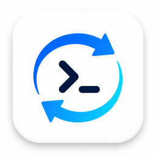
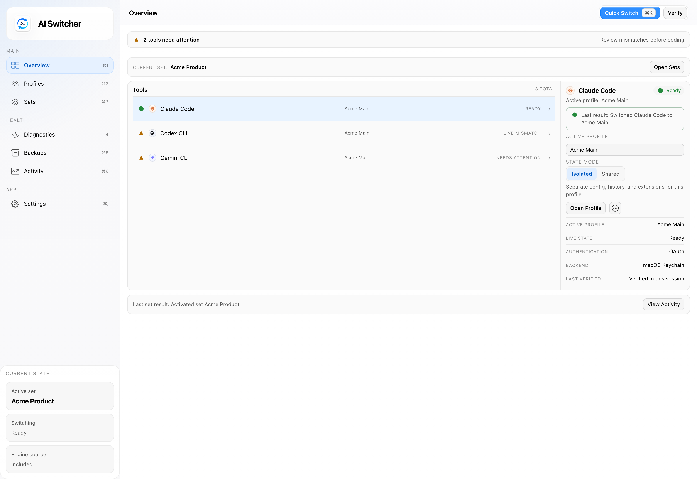
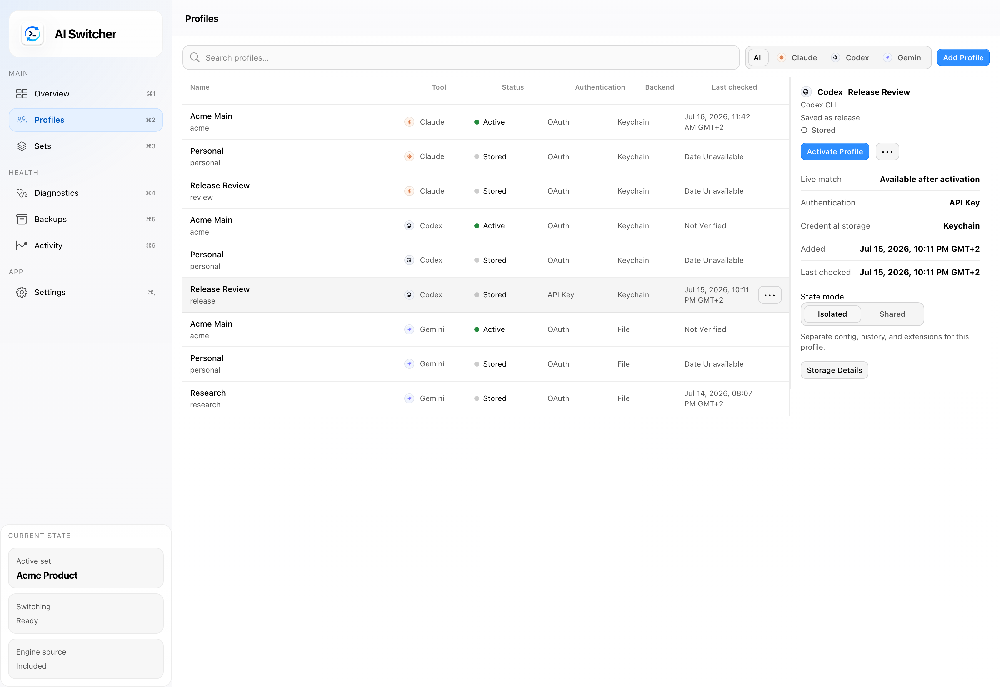
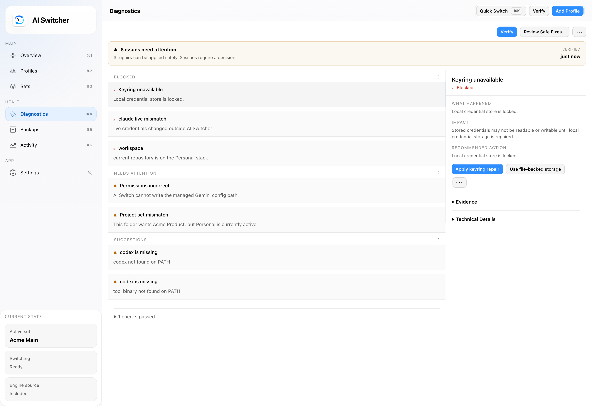

<p align="center">
  
</p>

# AI Switch Desktop

AI Switch Desktop is a local-first desktop app for switching between coding-agent identities through the [`aisw`](https://github.com/burakdede/aisw) runtime. It uses Tauri 2 for the native shell, Rust for the desktop bridge, and React + TypeScript for the UI.

<p align="center">
  
  
  
</p>

## What it does

- manages saved profiles for Claude Code, Codex CLI, Gemini CLI, and Antigravity CLI
- switches one tool or a saved multi-tool set from a native desktop UI
- runs diagnostics, verification, repair, and backup flows through the runtime
- supports bundled, system, and custom [`aisw`](https://github.com/burakdede/aisw) runtime sources
- keeps credentials and provider-specific auth handling inside the runtime layer

## Tech stack

- React 18 + TypeScript + Vite
- TanStack Query, Zustand, Zod
- Tauri 2
- Rust

Architecture details live in [docs/architecture.md](docs/architecture.md). Release and packaging steps live in [docs/release-runbook.md](docs/release-runbook.md).

## Architecture

- React feature panels talk to typed client helpers only.
- The Tauri command layer is the only frontend-to-native entry point.
- Rust owns runtime selection, command execution, updater validation, tray behavior, and error normalization.
- The bundled or selected [`aisw`](https://github.com/burakdede/aisw) runtime remains the source of truth for switching state, backups, verification, repair, and provider auth handling.

## Development

Prerequisites:

- Node.js `>=20.19.0`
- npm `>=10`
- Rust toolchain with Cargo
- Playwright browser binaries via `npx playwright install --with-deps chromium`

Install dependencies:

```sh
npm install
```

Stage a local `aisw` binary for desktop development:

```sh
npm run prepare:sidecar -- /absolute/path/to/aisw
```

You can build the sidecar from the [`aisw` repo](https://github.com/burakdede/aisw) or point at an existing local binary.

Run the desktop app:

```sh
npm run tauri:dev
```

## Verification

Frontend:

```sh
npm test
npm run test:coverage
npm run build
npm run test:e2e
npm run verify:release
```

Rust:

```sh
cargo fmt --manifest-path src-tauri/Cargo.toml --check
cargo clippy --manifest-path src-tauri/Cargo.toml --all-targets -- -D warnings
cargo test --manifest-path src-tauri/Cargo.toml
cargo check --manifest-path src-tauri/Cargo.toml
```

## Packaging

Unsigned local smoke bundle:

```sh
npm run tauri:bundle-local
```

Signed release bundle:

```sh
npm run tauri:build
```

Before either build, stage the correct [`aisw`](https://github.com/burakdede/aisw) sidecar with `npm run prepare:sidecar`. The repository does not track staged sidecar binaries.

## Repository notes

- local-only planning documents and scratch artifacts are intentionally ignored
- the desktop app is a control plane for the [`aisw`](https://github.com/burakdede/aisw) runtime, not a replacement for its credential and switching logic
- the release verifier checks CI, workflow, capability, and packaging contracts before a public release

## Contributing

See [CONTRIBUTING.md](CONTRIBUTING.md), [CODE_OF_CONDUCT.md](CODE_OF_CONDUCT.md), and [SECURITY.md](SECURITY.md).

## License

[MIT](LICENSE)
